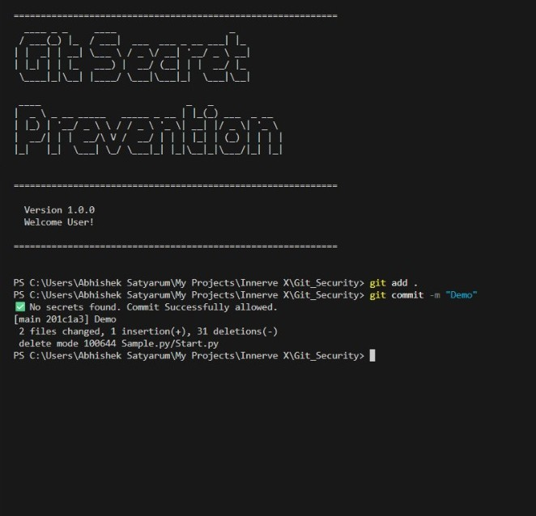
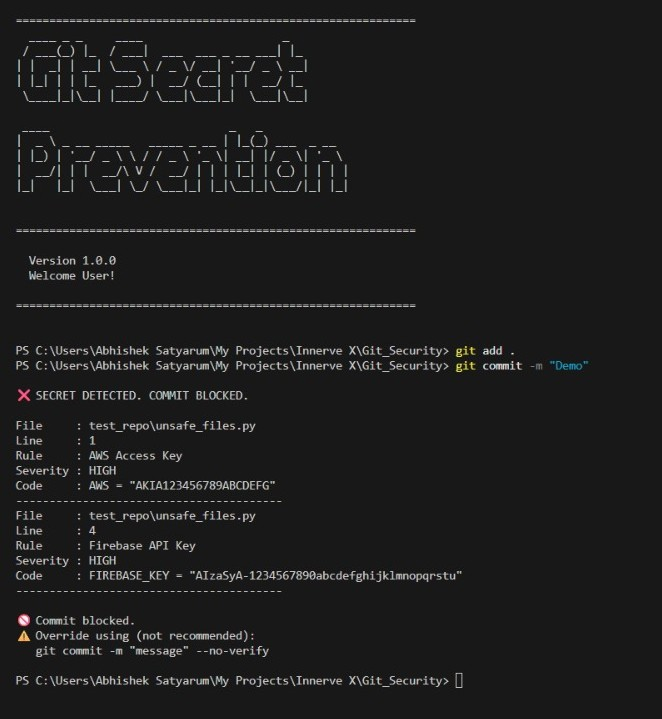

<h1><b>Git Secret Prevention(GSP)</b></h1>

Git Secret Prevention(GSP) is a pre-commit security gate that prevents developers from accidentally pushing API keys, tokens, and passwords to Git repositories.

It works on rule-based detection which is fast and reliable with its regex patterns. 
It has smart decision making program which blocks and warns the user about the API Keys, tokens, private keys etc.

 

## → Why It Matters?

- Oftenly, Secrets leaks to public repositories by the developers and they can be exploited within minutes, leading to unauthorized API usage, data breaches, cloud credentials, database passwords and financial loss. Attackers, bots, and automated scanners continuously monitor platforms like GitHub and GitLab for exposed secrets.

- As we know that, Git history is immutable by design: once a secret is pushed, it is stored in every clone and mirror of the repo, backup, and cache, which makes complete removal tedious and error-prone.

- Tools exist to rewrite history, but they are complex, can break forks or integrations, and still may not guarantee that the secret isn’t archived somewhere; in practice, teams often have to revoke and rotate every exposed credential.

- If the repo is public or briefly made public, scanning services and mirrors may already have captured the secret, so even rewriting history cannot “un-leak” it.

 

<h1><b>Solution</b></h1>

- Catching secrets before they enter the repository is the only reliable way to ensure they never appear in history, never replicate to other clones, and never reach external scanners.

- A pre‑commit check becomes a small safety net that runs in milliseconds on the developer’s machine, turning an easy human mistake (copy‑pasting a key during debugging) into a harmless, fixable warning.

- GSP shifts security from reactive firefighting (rotate keys, investigate logs, notify users) to proactive hygiene that quietly protects every commit, every day, with almost no friction.

 

<table>
  <tr>
    <td align="center"><b>If Secret is Absent👍 </b></td>
    <td align="center"><b>If Secret is Detected‼️</b></td>
  <tr>
    <td></td>
    <td></td>
  </tr>
</table>   

 

## → Benefits Of Using GSP

- It is a secret aware Git workflow that reduces the cognitive load on developers as they dont have to manually remember that "Not to commit this file". This tool enforces it consistently across the team.

- As organisation grows larger its more and more repos with confidencial contracts, so manual control and code review cannot reliably catch every secret, but automated pre‑commit protection scales linearly without depending on reviewer vigilance.

- Over time, this fosters a secure‑by‑default culture where developers internalize best practices (env vars, secret managers, .gitignore) because the tools repeatedly reinforce the right patterns at the moment they code.

 

## 🎥 Video Proof 

<video src="docs/Video%20Proof%20(2).gif" controls title="Video Title" width="600"></video>

"https://github.com/user-attachments/assets/2f62af67-5c1a-4686-b782-169b205a74dd"

<video src="[https://github.com/Abhishek-Satyarum/Git_Secret_Prevention/blob/main/docs/Video%20Proof%20(2).gif]" controls width="100%">Hello</video>
